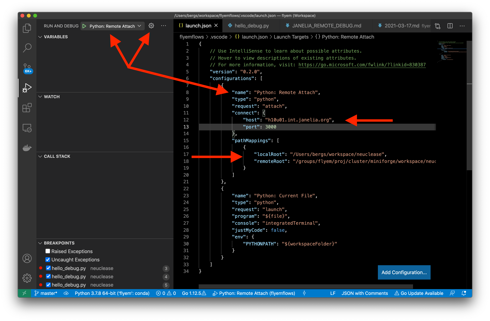

# Remote Debugging with VSCode on the Janelia Cluster

## Outline:

1. Setup
    1. Make sure the code exists on both the local machine and remote machine
    2. Install 'debugpy' on the remote machine
    3. Setup passwordless ssh access
2. Launch the debugger on the remote machine.
3. In VSCode, configure a launch configuration.
4. Start the debugging session on your local machine.

Generally, we're following instructions from:
https://code.visualstudio.com/docs/python/debugging#_remote-debugging

## 1. Setup

### i. Code setup

Make sure all Python code exists on both your local machine (e.g. laptop)
and your remote environment.  If you were to see line numbers in a Python error
traceback, would the line numbers match up on both sides?

### ii. Install debugpy

Install [debugpy][] (pip or conda).

[debugpy]: https://github.com/microsoft/debugpy

    conda install -c conda-forge debugpy

### iii. ssh access

Also, make sure you've already setup [passwordless ssh access][ssh].

[ssh]: https://help.dreamhost.com/hc/en-us/articles/216499537-How-to-configure-passwordless-login-in-Mac-OS-X-and-Linux

## 2. Launch the debugger on the remote machine.

Reserve a slot and start up the remote debugger server, with the program arguments.
(And make note of the cluster node you end up on.)

    ssh submit

    JOB_NAME='my-interactive-job'
    N_SLOTS=1
    QUEUE=local
    MAX_HOURS=8

    # Launch an interactive job
    bsub -J ${JOB_NAME} -n ${N_SLOTS} -q ${QUEUE} -W ${MAX_HOURS}:00 -Is /bin/bash

    conda activate my-development-environment

    # Launch the vscode remote debugger
    echo "Starting remote debugging server on $(uname -n)"
    python3 -m debugpy --listen 0.0.0.0:3000 --wait-for-client /path/to/my/main/program.py ${YOUR_PROGRAM_ARGS_HERE}

## 3. VSCode launch configuration

Configure it with the name of your remote machine (e.g. `h10u01.int.janelia.org`),
and specify the same port you chose when you launched the debugger above (e.g. `3000`).

Make sure your `localRoot` and `remoteRoot` directories are configured to point at matching directory trees on the local/remote side.  The script you want to debug should reside in both the `localRoot` and `remoteRoot`.

### Example `launch.json`

    {
        "version": "0.2.0",
        "configurations": [
            {
                "name": "Python: Remote Attach",
                "type": "python",
                "request": "attach",
                "connect": {
                    "host": "h10u01.int.janelia.org",
                    "port": 3000
                },
                "pathMappings": [
                    {
                        // The local and remote root directories must have similar contents
                        // if you want to debug remote scripts that reside in them
                        // (as opposed to in your site-packages folder).
                        "localRoot": "/path/to/my/local/workspace",
                        "remoteRoot": "/path/to/my/remote/workspace"
                    }
                ]
            },
            {
                "name": "Python: Current File",
                "type": "python",
                "request": "launch",
                "program": "${file}",
                "console": "integratedTerminal",
                "justMyCode": false,
                "env": {
                    "PYTHONPATH": "${workspaceFolder}"
                }
            }
        ]
    }

## 4. Start the debugging session on your local machine.

In the debugging sidebar, select your new run configuration as shown in the screenshot above. Then give it a try.
With your target file open, select Run > Start Debugging.

---

## Optional: Use an ssh tunnel

Apparently I can access the cluster nodes directly from my laptop.
But if that weren't the case, an ssh tunnel via the login1 node might be necessary.
In the past, I thought this was a requirement, but today it seems to work without a tunnel.
Anyway, if you need this, then you'll also need to change your launch configuration to use `"host": "localhost"`.

    REMOTE_MACHINE=h10u01.int.janelia.org
    ssh -L 3000:${REMOTE_MACHINE}:3000 bergs@submit

